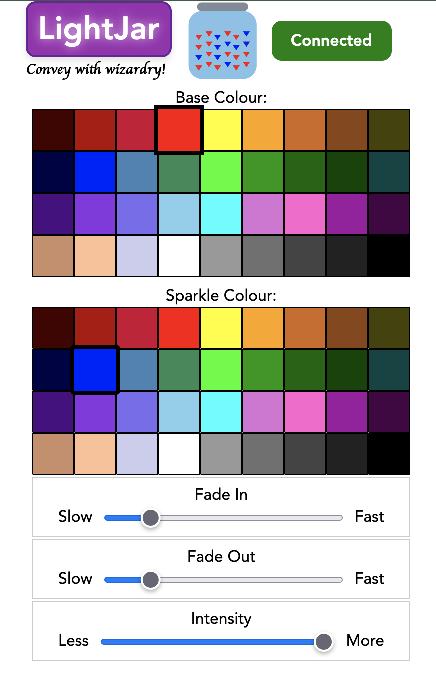

# LightJar
#### <i>Convey with wizardry!</i>



A decorative/mood light that you can update live using any web browser on your network. This uses MQTT via websockets to send the data. Works with Pimoroni Skully hardware etc. It uses [this](https://github.com/digitalurban/MQTT-Plasma-Stick-2040W/blob/main/mqtt_as.py) lightweight micropython MQTT client by Peter Hinch, and assumes you have an existing MQTT broker on your network. Essentially, this project takes code from the [Pimoroni examples](https://github.com/pimoroni/pimoroni-pico/tree/main/micropython/examples/plasma_stick) (sparkles.py) and makes it easier to change the colour/intensity/fade settings via a colourful web interface. You don't need to know code or Thonny to change the ambience, and anyone on the network can join in (or have a colour fight!)

## Requirements:
1) MQTT Broker

You must have a broker on the network you wish to use. I am using Mosquitto which is running on my Synology NAS. This must be configured to use websockets on a specified port.

2) Hardware
- [Plasma Stick 2040 W](https://shop.pimoroni.com/products/plasma-stick-2040-w)
- RGB LEDs ([These ones are ideal](https://shop.pimoroni.com/products/5m-flexible-rgb-led-wire-50-rgb-leds-aka-neopixel-ws2812-sk6812))
- USB (Micro B) power cable
- A large glass jar or vase (eg from a Swedish furniture shop), though the LEDs can fit in an empty(!) rum bottle
- (optional) filler material, to diffuse and soften the light

## Setup

1) Configure your MQTT Broker to use websockets

For Mosquitto, edit the ```mosquitto.conf``` as follows.

Scroll to the ```Listeners``` section, note there may already be one or more listeners followed by a port number. Choose a (different) port number to use for your websocket (eg 9001), and append the following to the end of the section:
```
#Configure a listener on port 9001, using websockets:
listener 9001
protocol websockets
```
> If you are using MQTT over TLS/SSL, you need to specify additional options here for the certificate

Restart your MQTT service (check mosquitto.log for errors)
>On Synology, the config file (and log file) may be located at:
```/var/packages/mosquitto/var/```

2) Assemble your LightJar
- Plug the STEMMA connector into the Plasma Stick
- Wrap the LEDs around and within the filler material (if using), try to get uniform spacing
- Stuff the bundle into the jar, try to fill out the corners and space the LEDs evenly - more on the outside than the centre
- Trail the USB cable out of the jar (you may wish to use Something Sticky(TM) to attach the Plasma Stick to the jar at the back)
- Check everything works and all LEDs light up

3) Configure ```lightjar.html```
You need edit the HTML document to specify the MQTT Broker address (eg IP address or domain name) and the correct port. Ideally copy this to a locally running webserver (on the same network as the MQTT broker of course), but you can use it standalone.

4) Upload the code!
   
Using Thonny, for example:
- Update the firmware if necessary, **make sure to use the '[Pirate-branded](https://github.com/pimoroni/pimoroni-pico/releases)' micropython** (tested using version ```1.21.0```)
- Edit ```WIFI_CONFIG.py``` to include your WiFi credentials if necessary
- Edit ```LIGHTJAR_CONFIG.py``` to include your broker details, ```NUM_LEDS``` etc
- Upload the files:
   1) ```mqtt_as.py```
   2) ```WIFI_CONFIG.py```
   3) ```LIGHTJAR_CONFIG.py```
   4) ```main.py``` 

   to the Plasma Stick

## Use your LightJar

Open ```lightjar.html``` in a browser. All being well the 'Connected' indicator should be green!

Use the colour pickers and sliders to send different light patterns to the LightJar. The values are transmitted over MQTT to the LightJar (as you change them), which then sets the parameters accordingly.

You could extend this code to perform different functions, allow for different patterns etc - your creative potential is bound solely by the scope of your imagination ;)

Thanks to Pimoroni of Sheffield-on-Sea for the excellent hardware and library, and Peter Hinch for the MQTT micropython client
